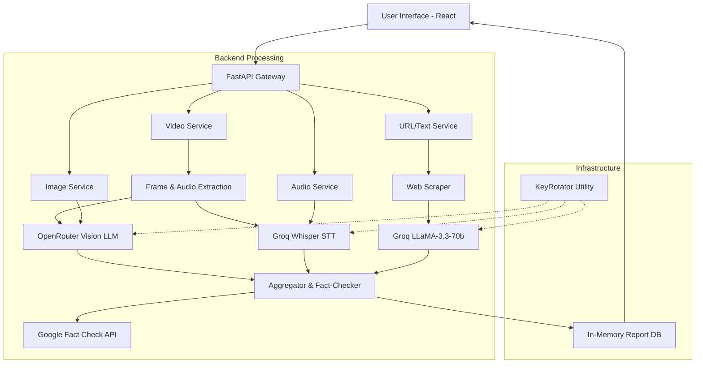

# TruthLens: Multimodal Misinformation Detection System

## Introduction
TruthLens is a professional-grade platform engineered to combat the proliferation of digital misinformation. By leveraging state-of-the-art Large Language Models (LLMs) and Vision Transformers, TruthLens provides users with a comprehensive toolset to verify the authenticity of video, audio, images, and text-based content.

The system is designed with a focus on usability, technical transparency, and scalable infrastructure, making it a practical solution for journalists, researchers, and general users in an era of sophisticated synthetic media.

## System Architecture



## Scalability & Reliability

TruthLens is engineered to handle variable workloads and ensure consistent uptime, even when interacting with rate-limited external AI providers.

### Strategic API Key Rotation
A core bottleneck in AI applications is Provider Rate Limiting (HTTP 429). TruthLens implements a custom `KeyRotator` utility that manages pools of API keys for Groq and OpenRouter. 
- **Round-Robin Distribution:** Requests are distributed evenly across available keys to prevent exhaustion.
- **Fault Tolerance:** If a key hits a rate limit or fails, the system automatically tags it for a cooldown period and retries the request with the next healthy key in the queue, ensuring the end-user rarely experiences a hard failure.

### Deterministic State Management
To guarantee that TruthLens acts as a reliable forensic tool rather than a creative generator:
- **Zero Temperature:** All LLM and Vision API calls execute with `temperature=0.0`, forcing the neural networks into their most deterministic and logical states.
- **Strict JSON Contracts:** The backend enforces rigorous output schemas. If an LLM hallucinates markdown around its JSON sequence, custom parsing utilities strip the artifacts, preventing application crashes.

### Asynchronous & Stateless Architecture
- **FastAPI Asynchrony:** The backend utilizes Python's `asyncio` to handle concurrent user requests without blocking the main event loop, crucial for high-latency tasks like video frame extraction or Whisper audio transcription.
- **Stateless Aggregation:** The Verification Engine operates completely statelessly. Once a report is generated and the unified JSON schema is returned, no residual processing threads remain, keeping memory overhead low.
- **In-Memory Caching (Phase 1):** Repeated URL analyses or identical queries hit a fast in-memory dictionary cache before pinging expensive LLMs, rapidly serving hot data.

## Future Roadmap

### Short-Term Refinements
- **Advanced OCR Integration:** Extract and analyze text overlays within video frames and images to detect narrative discrepancies.
- **Persistent Storage:** Migrate from in-memory dictionary storage to a managed database (e.g., PostgreSQL or MongoDB) for historical report tracking.
- **Batch Processing:** Allow users to submit multiple URLs or files simultaneously for parallel analysis queues.

### Medium-Term Scalability
- **Distributed Worker Nodes:** Move media processing (FFmpeg/OpenCV) away from the API gateway to distributed workers using Celery or Redis Queues to handle concurrent users more effectively.
- **Dedicated Forensic Models:** Integrate specialized small-language models and CNNs (Convolutional Neural Networks) trained strictly on misinformation datasets/ELA (Error Level Analysis) to reduce reliance on external LLM providers for visual deepfake detection.
- **User Accounts & Histories:** Allow researchers to maintain private dashboards of verified content and share reports via permanent links.

### Long-Term Vision
- **Browser Extension:** Real-time analysis of social media feeds via a browser-integrated TruthLens overlay (auto-flagging X/Twitter or Meta links).
- **Enterprise SaaS API:** Expose the TruthLens multimodal aggregation engine as an enterprise API for professional news organizations and fact-checkers.
- **Live Stream Interception:** Expand the video pipeline to process live RTMP streams for real-time deepfake detection during broadcasts.

## Setup and Installation
Refer to `backend/API_SETUP_GUIDE.md` for detailed environment configuration and API key requirements.

### Backend
```bash
cd backend
pip install -r requirements.txt
uvicorn main:app --host 0.0.0.0 --port 8000
```

### Frontend
```bash
cd frontend
npm install
npm run dev
```
